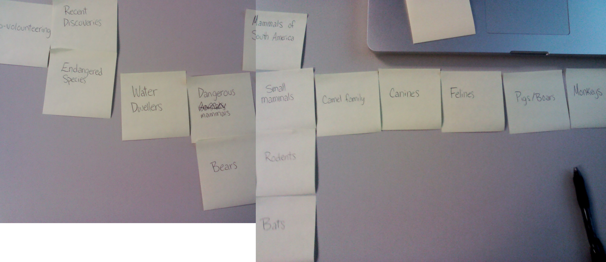
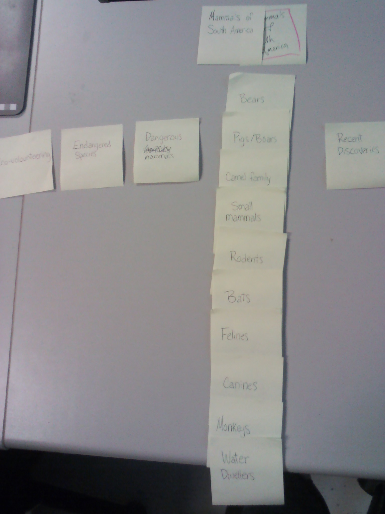

# Card sort report

The goal of this card sort was to determine common navigation patterns and categories from the content of my data-oriented website, Mammals of South America.

## Specifics

The card sort was conducted by Lianne on September 10, 2013 between the times of 9:30am and 10am with the following participants:

- Stephanie Csanky
- Sabrina Ng

### Cards

15 cards were used covering a broad range of applicable content for the website. The following topics were used as cards:

1. Mammals of South America
2. Monkeys
3. Water Dwellers
4. Bats
5. Small Mammals
6. Felines
7. Canines
8. Pigs and Boars
9. Bears
10. Camels
11. Rodents
12. Dangerous Mammals
13. Endangered Species
14. Recent Discoveries
15. Eco-volounteering

## Card sort results

*Card sort 1 by Stephanie Csanky*

*Card sort 2 by Sabrina Ng*

## Observations

Sabrina organized my cards exactly the way I had envisioned them; Stephanie's approach was very similar, but with a few noticeable differences. I hadn't previously
considered making Rodents and Bats sub-categories of Small Mammals, but this is logical and would help minimize the amount of options beneath the Mammals section.
There seemed to be a bit of a struggle with my cards since some of them were categories with no content-cards; I planned on having just one article in each of 
these sections (Dangerous Mammals, Endangered Species, Recent Discoveries, and Eco-volounteering). However, there is a list of endangered species, so it could in 
fact have its own section: the list of animals with each their own page. It was interesting to watch them perform the task — almost like conducting a study to see 
the difference in peoples' logic.